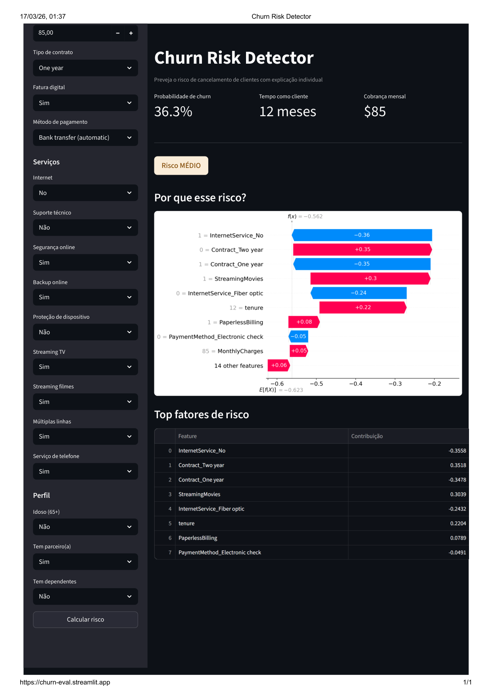
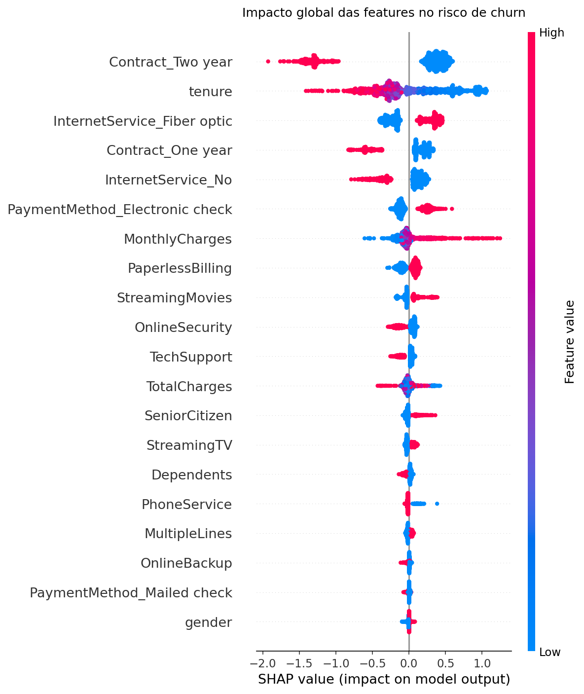
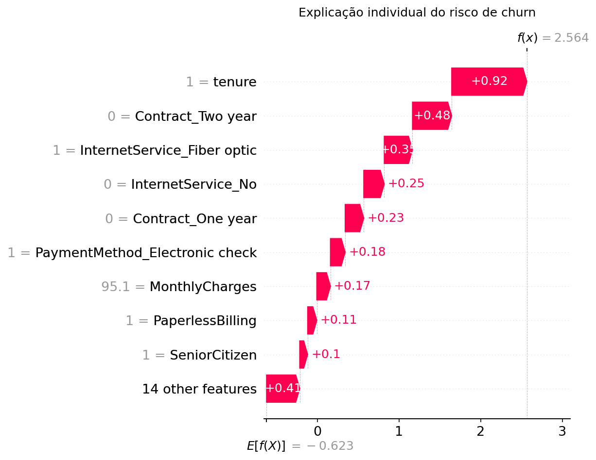

# Churn Risk Detector

> Uma empresa de telecom perde em média $300 por cliente que cancela.
> Este modelo identifica **82% dos clientes em risco** antes que o churn aconteça,
> com explicação individual de quais fatores causam o risco.

## Demo ao vivo

[🔗 Abrir app](https://churn-eval.streamlit.app/)



---

## O problema

Churn — quando um cliente cancela o serviço — é um dos maiores custos ocultos
de empresas SaaS e telecom. O desafio não é só prever **se** o cliente vai
cancelar, mas entender **por quê**, para que times de retenção possam agir
com antecedência.

## A solução

Pipeline completo de ML com explicabilidade por cliente individual:

- Classifica o risco de churn em **ALTO / MÉDIO / BAIXO**
- Explica os fatores específicos que levaram àquela predição via **SHAP**
- Interface interativa onde o time de sucesso do cliente insere os dados
  e recebe o diagnóstico em tempo real

## Resultados

| Modelo | ROC-AUC | Recall (churn) | Precision (churn) |
|---|---|---|---|
| Logistic Regression (baseline) | 0.84 | 55% | — |
| XGBoost | 0.8446 | 82% | 52% |

O XGBoost empata no ROC-AUC mas detecta **82% dos churns reais** contra
55% do baseline — na prática isso significa muito menos clientes perdidos
sem intervenção.

## Principais insights do EDA

- Clientes com **contrato mensal** churnam 43% das vezes vs 3% no bienal
- **Fiber optic** tem taxa de churn de 42% — o dobro do DSL
- Clientes **sem suporte técnico** churnam 2.8x mais
- A maioria dos churns acontece nos **primeiros 12 meses** de contrato

## SHAP — explicabilidade

O diferencial do projeto está na explicabilidade individual. Além de saber
o risco, o modelo mostra exatamente quais features empurraram aquele cliente
para o risco alto ou baixo:



*Vermelho = aumenta risco de churn · Azul = reduz risco de churn*



*Exemplo: cliente de alto risco — contrato mensal + fiber optic + sem suporte*

## Stack

- **Modelagem:** XGBoost, scikit-learn
- **Explicabilidade:** SHAP (TreeExplainer)
- **Interface:** Streamlit
- **Dados:** [Telco Customer Churn — Kaggle](https://www.kaggle.com/datasets/blastchar/telco-customer-churn)

## Estrutura do projeto
```
churn-detector/
├── data/
│   └── telco_churn.csv
├── notebooks/
│   ├── 01_eda.ipynb
│   ├── 02_preprocess_check.ipynb
│   ├── 03_train.ipynb
│   └── 04_explain.ipynb
├── src/
│   ├── preprocess.py
│   ├── train.py
│   └── explain.py
├── app/
│   └── streamlit_app.py
├── models/
│   ├── xgb_model.pkl
│   └── feature_columns.pkl
├── assets/
└── README.md
```

## Como rodar localmente
```bash
# Clone o repositório
git clone https://github.com/SEU_USUARIO/churn-detector
cd churn-detector

# Crie o ambiente virtual
python -m venv .venv
.venv\Scripts\activate       # Windows
source .venv/bin/activate    # Linux/Mac

# Instale as dependências
pip install uv
uv pip install -r requirements.txt

# Baixe o dataset
# kaggle.com/datasets/blastchar/telco-customer-churn → salve em data/

# Treine o modelo
python src/train.py

# Rode o app
streamlit run app/streamlit_app.py
```

## Próximos passos

- [ ] Threshold tuning — ajustar o ponto de corte para maximizar recall
- [ ] Feature engineering — adicionar razão MonthlyCharges/tenure
- [ ] Monitoramento — detectar data drift com Evidently

> **Nota sobre precision vs recall:** O modelo foi otimizado para maximizar
> o recall (detectar o máximo de churns reais), aceitando um número maior
> de falsos positivos. Em retenção de clientes, o custo de **não detectar**
> um churn real é geralmente maior do que o custo de uma ação de retenção
> desnecessária.
